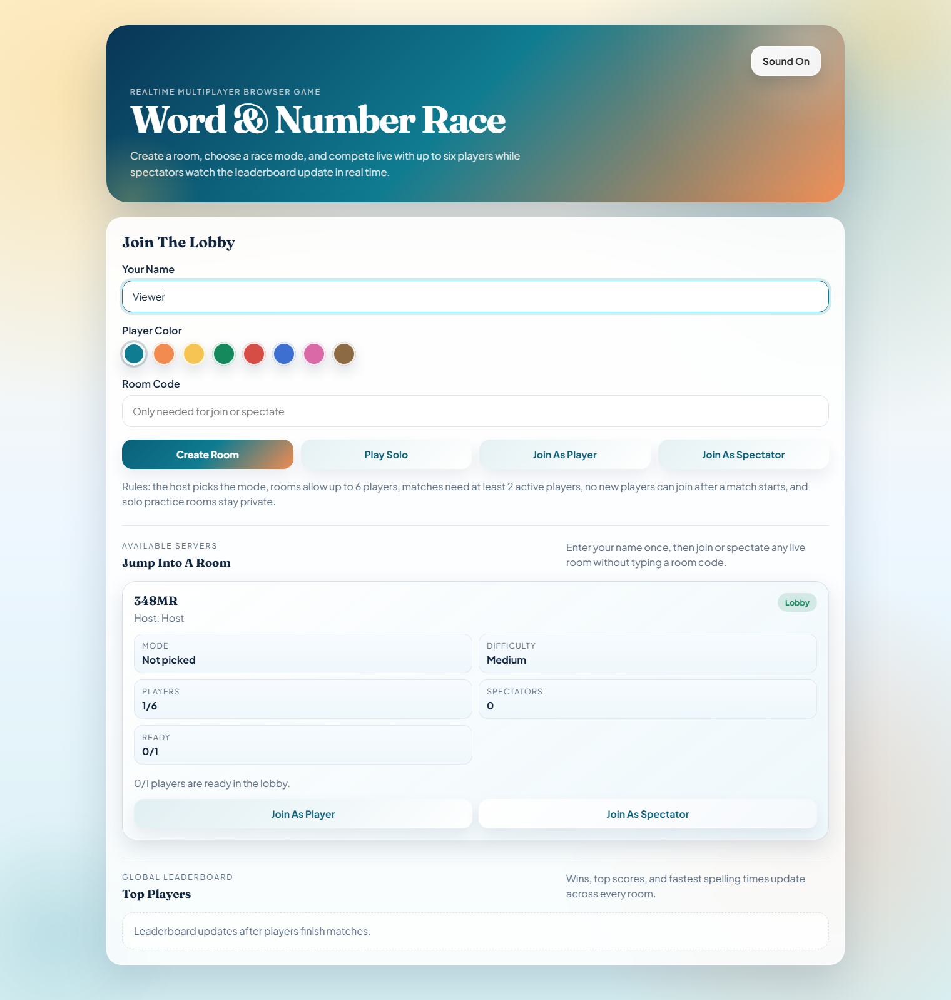
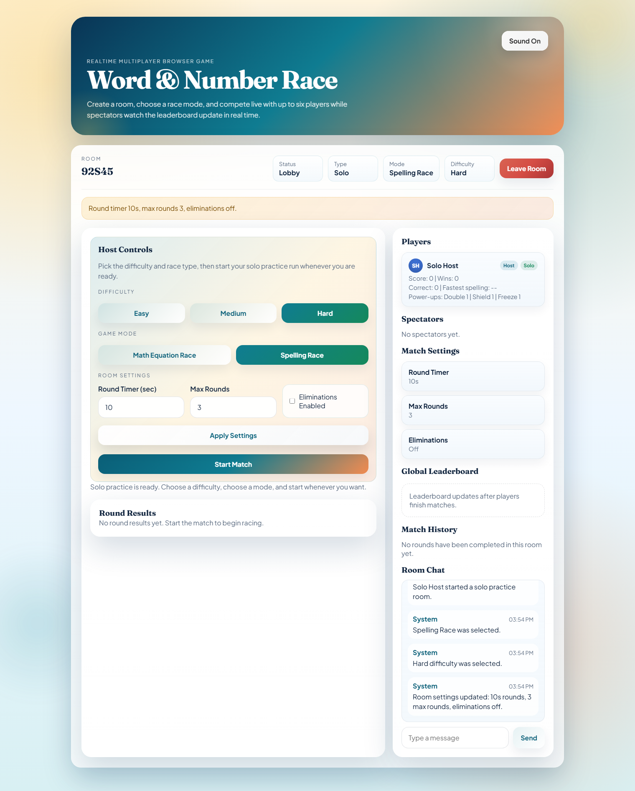
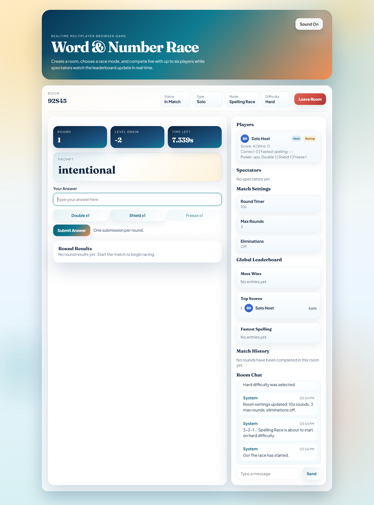
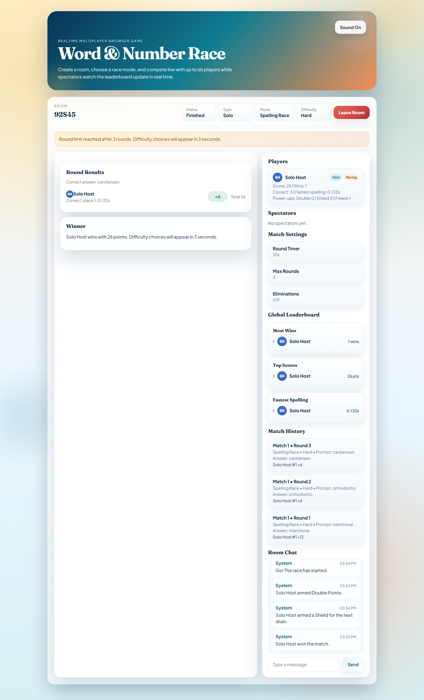

# Word & Number Race

Word & Number Race is a real-time multiplayer browser game built with Node.js, Express, Socket.IO, HTML, CSS, and vanilla JavaScript.

Players can:

- create multiplayer rooms
- join rooms as racers or spectators
- play `Math Equation Race` or `Spelling Race`
- practice in a private `Solo` room
- use power-ups during matches
- customize room settings
- chat live during games
- track wins, best scores, and spelling speed on the global leaderboard

## Screenshots









## Features

- Real-time multiplayer gameplay with Socket.IO
- Up to 6 players per multiplayer room
- Spectator mode
- Private solo practice rooms
- Host-selected game mode and difficulty
- Ready system with countdown start
- Custom room settings:
  round timer, max rounds, eliminations on/off
- Power-ups:
  `Double`, `Shield`, `Freeze`
- Large spelling word banks for all difficulty levels
- Match history per room
- Global leaderboard for wins, best score, and fastest spelling times
- Player color avatars
- Room chat
- Winner screen and rematch flow

## Game Modes

### Math Equation Race

- Each player gets the same equation.
- Correct answer gives points.
- A drain happens each round.
- If eliminations are enabled and a player reaches `0`, they are out and become a spectator.

### Spelling Race

- Each player gets the same spelling word.
- Faster correct answers rank higher and earn more points.
- Fastest spelling times are tracked.
- If eliminations are enabled and a player reaches `0`, they are out and become a spectator.

## Power-Ups

- `Double`: doubles your next round score gain
- `Shield`: blocks the next round drain
- `Freeze`: briefly freezes the other active racers

Each player starts a match with one of each power-up.

## Tech Stack

- Node.js
- Express
- Socket.IO
- HTML
- CSS
- Vanilla JavaScript

## Getting Started

### 1. Install dependencies

```bash
npm install
```

### 2. Start the server

```bash
node server.js
```

### 3. Open the game

Visit:

```text
http://localhost:3000
```

## Project Structure

```text
.
├─ data/
│  ├─ spelling-easy.json
│  ├─ spelling-medium.json
│  └─ spelling-hard.json
├─ public/
│  ├─ client.js
│  ├─ index.html
│  └─ styles.css
├─ screenshots/
├─ server.js
├─ package.json
└─ README.md
```

## Publish / Deploy

This project is ready to deploy on any Node.js host that supports WebSockets, such as:

- Render
- Railway
- Fly.io
- a VPS with Node.js

### Basic deploy settings

- Build command:
  `npm install`
- Start command:
  `node server.js`

No database is required right now.

## Notes

- The global leaderboard is currently stored in memory while the server is running.
- Solo rooms are private and do not appear on the public room board.
- The spelling word banks are loaded from JSON files in the `data/` folder.

## Play Online

- https://adhrit-spell-solve-arena-game.onrender.com
